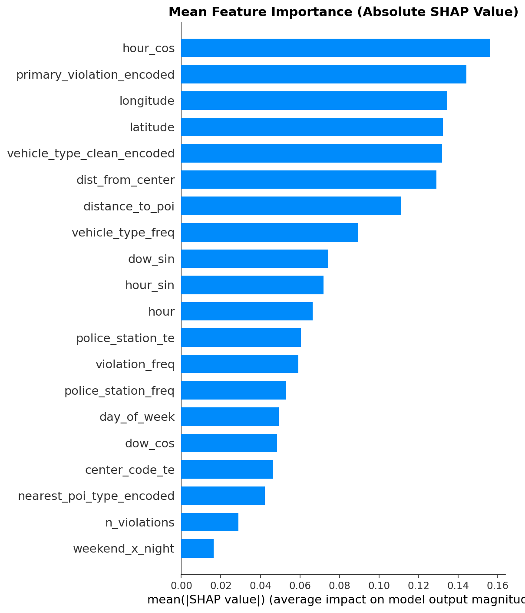
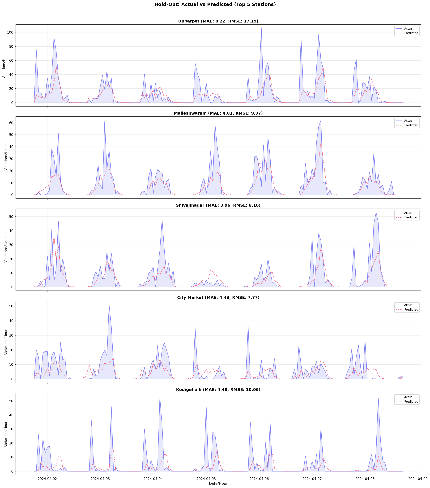
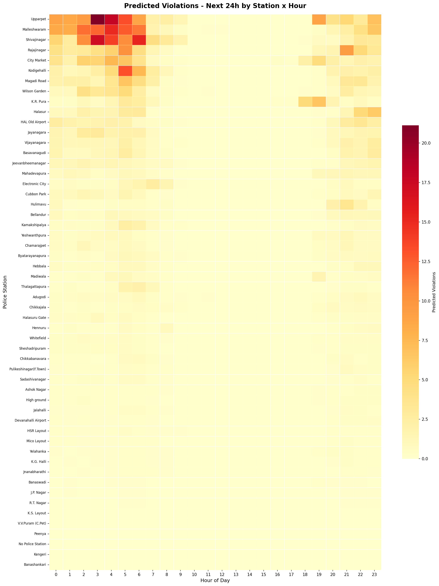
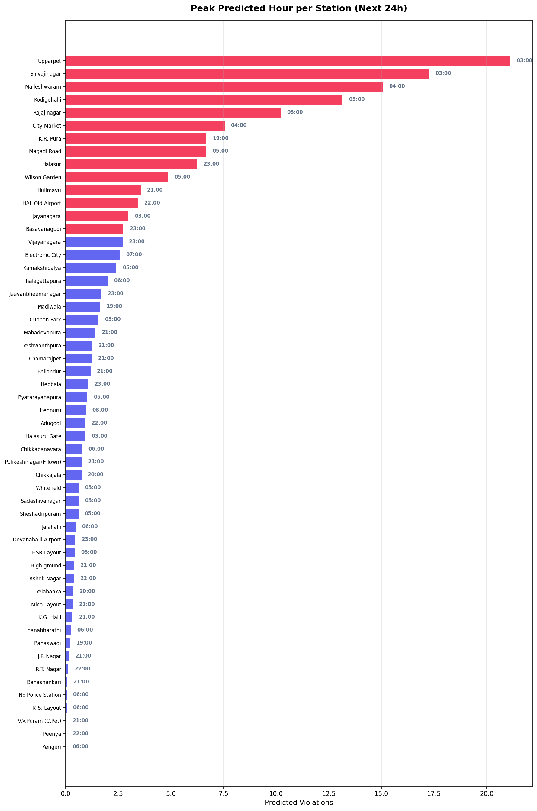
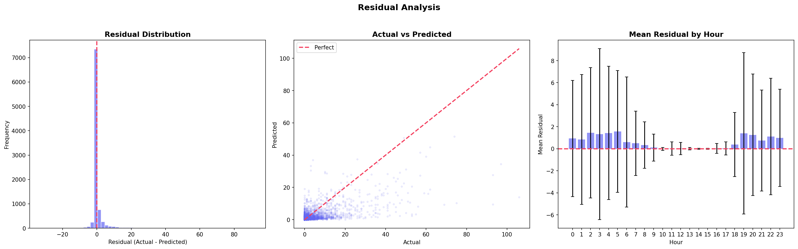

# PRISM — Predictive Routing and Intelligent Shift Management


## Problem Statement

> How can AI-driven parking intelligence detect illegal parking hotspots and quantify their impact on traffic flow to enable targeted enforcement?

Enforcement is historically patrol-based and reactive. No heatmap of parking violations vs. actual congestion impact exists, making it difficult to prioritize enforcement zones. PRISM produces a **per-violation operational priority score** by combining rule-based heuristics with machine learning models.

---

## Key Features & Models

### Feature 1: Operational Priority Scoring System
Our core innovation produces a **per-violation operational priority score** by combining rule-based heuristics with machine learning. This mathematically elevates hidden bottlenecks to the top of the dispatch queue using the formula:
`operational_priority = congestion_impact × P(rejection)`

A **high-severity violation with high P(rejection)** is the most dangerous case — real-world impact is massive, but the system is statistically predicted to ignore it.

It consists of two deeply integrated components:

**Component A: Congestion Impact Scoring (Rule-Based)**
A transparent formula evaluating the physical gridlock potential of a violation based on severity parameters.
- **Weights**: Integrates fuzzy-matched Offence Weights (Scale 1.0 - 5.0), Junction Multipliers, Vehicle Types, and Hour Multipliers.

**Component B: Propensity-to-Reject Classifier (XGBoost)**
An XGBoost classifier modeling human/institutional dispatch behaviour. It calculates **P(rejection)**: the probability that the institution will ignore the ticket without algorithmic intervention.
- **Model**: XGBoost  (26 engineered features including spatial-temporal encodings).
- **Performance Metrics**: **0.75 Validation ROC-AUC** | **0.84 F1 Score**.



### Feature 2: Traffic Demand Forecasting
A robust time-series forecasting pipeline to predict peak parking violations across specific zones, enabling pre-emptive patrol deployment.
- **Model Architecture**: Optimized forecasting model utilizing hourly temporal dynamics.
- **Impact**: Accurately maps expected violation volume against actuals, reducing response latency.






### Feature 3: Anomaly Detection (Isolation Forest)
An unsupervised learning module designed to instantly flag irregular spatial-temporal violation patterns, such as sudden clustered gridlocks outside of typical rush hours.

---

## Local Deployment Steps

PRISM v2.0 is built on a high-performance microservices architecture.

### 1. Build the Analytics Cache
PRISM uses a lightning-fast caching layer. Before starting the backend for the first time, you must run the precompute script. This processes all records through the ML pipelines and saves them to JSON.
```bash
python precompute.py
```

### 2. Start the FastAPI Backend
Once the cache is built, start the backend server (starts in under 2 seconds).
```bash
python -m uvicorn backend.main:app --host 127.0.0.1 --port 8000
```

### 3. Start the Next.js Frontend
Launch the interactive dashboard.
```bash
cd frontend
npm install
npm run dev
```

Visit the live dashboard at **http://localhost:3000**

---

## Architecture Blueprint

```
flipkard-prism/
├── backend/                  # FastAPI Application
│   ├── api/                  # REST endpoints
│   ├── engine/               # Rules & Inference Engines
│   ├── services/             # Core orchestration and caching
│   └── models/               # XGBoost and Isolation Forest artifacts
├── frontend/                 # Next.js App Router
├── forecast_charts/          # Forecasting visualizations
└── datasets/                 # Raw anonymized CSV
```

## Dependencies

**Backend**
- `fastapi >= 0.115`, `uvicorn >= 0.30`
- `xgboost >= 3.0`, `scikit-learn >= 1.8`, `pandas >= 2.0`

**Frontend**
- `next >= 15.0`, `react >= 19.0`
- `leaflet`, `tailwindcss`
